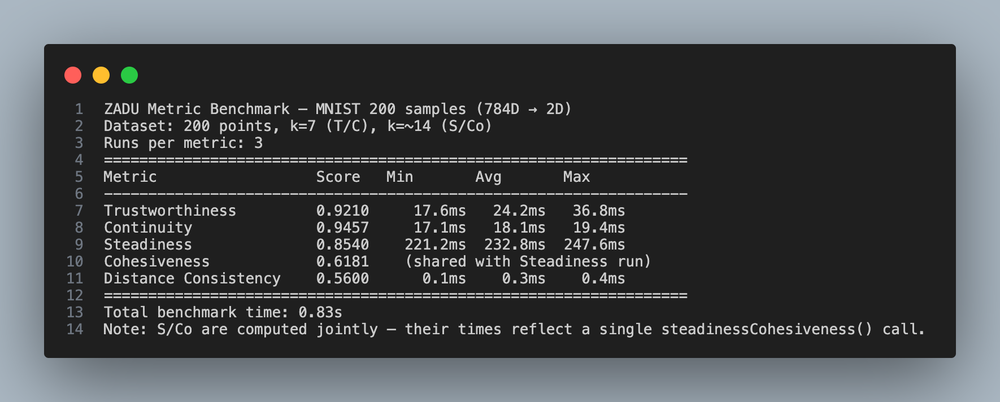

# ZADU Metric Benchmark Report

**Project:** ZADU.js — Dimensionality Reduction Quality Assessment
**Author:** Jonathan Tarun Rajasekaran
**Date:** March 2026

---

## Overview

This report documents the computation time for each ZADU quality metric on the MNIST-200 dataset. Times were measured using `performance.now()` across 3 repeated runs per metric to account for variance.

---

## Dataset

| Property | Value |
|----------|-------|
| Dataset | MNIST digits |
| Samples | 200 (20 per digit class) |
| Original dimensions | 784D |
| Embedding dimensions | 2D (UMAP via DruidJS) |
| UMAP parameters | n_neighbors=15, min_dist=0.1, _n_epochs=350, seed=42 |
| k (T/C metrics) | 7 |
| k (S/Co metrics) | ~14 (default: √n) |

---

## Results

| Metric | Score | Min | Avg | Max |
|--------|-------|-----|-----|-----|
| Trustworthiness | 0.9210 | 17.6ms | 24.2ms | 36.8ms |
| Continuity | 0.9457 | 17.1ms | 18.1ms | 19.4ms |
| Steadiness | 0.8540 | 221.2ms | 232.8ms | 247.6ms |
| Cohesiveness | 0.6181 | — | — | — |
| Distance Consistency | 0.5600 | 0.1ms | 0.3ms | 0.4ms |

> **Note:** Steadiness and Cohesiveness are always computed jointly via a single `steadinessCohesiveness()` call. The times shown for Steadiness apply to both metrics combined; Cohesiveness has no separate timing.



---

## Observations

- **Trustworthiness and Continuity** take roughly the same time (~18–25ms avg). Both compute two full pairwise distance matrices (O(n² × d)), which is the bottleneck.
- **Steadiness and Cohesiveness** are significantly more expensive (~233ms avg). The extra cost comes from randomized cluster extraction over 150 iterations used to detect false and missing cluster structure.
- **Distance Consistency** is near-instant (<1ms). It only operates on the 2D embedding and class labels — no high-dimensional distance computation required.

---

## How to Reproduce

```bash
node examples/benchmark-metrics.js
```

Source: [`examples/benchmark-metrics.js`](../examples/benchmark-metrics.js)
Data: [`examples/mnist-200-embedding.json`](../examples/mnist-200-embedding.json)
